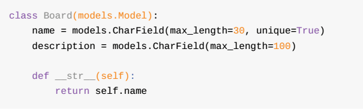
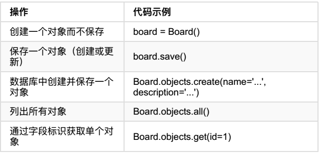

# python-Django

This repo is a collection of study demo of Django
1. cd dj03(or other)/myproject
2. python manage.py runserver
3. open http://127.0.01:80000

## dj01: how to build environment

## dj02: creat a simple project of Django

	1. django-admin startproject myproject

	2. 目录组成
	   * manage.py 用于运行管理项目 的 管理命令 。比如运行开发服务器，运行测试，创建迁移等 
	   * __init.py 告诉python 这个文件夹是一个python
	   * settings.py 比较重要 包含所有的项目配置。
	   * urls.py     映射项目中的路由与路径 
	   * wsgi.py     部署简单的网管接口  

	3. python manage.py runserver   

	4. 打开 http://127.0.0.1:8000

	5. django-admin startapp boards

	6.目录组成 
	  *  migrations/ 次文件夹， Django 会存储一些文件来跟踪你在models.py 文件中创建的 变更。用来保持数据库和models.py 的同步
	  *  admin.py  此文件是一个django内置的应用程序Django Admin 的配置文件
	  *  app.py    应用程序本身的配置文件
	  *  models.py 此文件用来定义 Web应用程序实例的地方。models会有Django自动转化为数据库表
	  *  tests.py  此文件用来写当前程序的单元测试
	  *  views.py  此文件是用来处理Web应用程序 request 与 response 周期文件
	7. settings.py 中添加 boards

## dj03: creat a simple view of Hello,World 
	1. 	add request and response in views.py
	2.  add url setting in urls.py 

## dj05  model created
	1.  models.py   creat the class of model  在此文件夹创建对应的 model 类
	2.  激活虚拟环境  并  执行 python manage.py makemigrations  产生 0001_inital.py
	3.  python manage.py sqlmigrate boards 0001
	4.  python manage.py migrate  //至此 数据库建设好了

	  python 中的shell 来操作 数据 (增删改查)

	5. python manage.py shell  // 进入shell 模式  换行用 \
	6. 增加一个数据  from boards.models import Board   board = Board(name='xxx',description='des') board.save()
	7. 查询  board.id  board.name 
	8. 改    board.name='abc' board.save()

		模型管理器(Model Manager) 通过属性objects 属性来 访问管理器，主要用于数据库操作
	9.  创建 board = Board.objects.creat(name='name2',description='des python')
	10. 查询 Board.ojects.all()       board = Board.objects.get(id=3)

	
	

## dj06  first view
	1. 在 views.py 中添加代码cls
```python
	from django.shortcuts import render
	# Create your views here.
	from django.http import HttpResponse
	from .models import Board

	def home(request):
		boards = Board.objects.all()
		boards_names = list()
		for board in boards:
			boards_names.append(board.name)

		response_html = '<br>'.join(boards_names)
		return HttpResponse(response_html)
```
## dj07 set template 
	1. 创建 Templates 文件 xx.html 
```html
		<!DOCTYPE html>
	<html>

	<head>
	    <meta charset="utf-8">
	    <title>Boards</title>
	</head>

	<body>
	    <h1>Boards</h1>
	    <table border='1'>
	        <thead>
	            <tr>
	                <th>Board</th>
	                <th>Posts</th>
	                <th>Topics</th>
	                <th>Last Post</th>
	            </tr>
	        </thead>
	        <tbody>
	            
	            <tr>
	                <td>
	                    {{board.name}}
	                    <br>
	                    <small style="color: #888">{{board.description}}</small>
	                </td>
	                <td>0</td>
	                <td>0</td>
	                <td></td>
	            </tr>
	            
	        </tbody>
	    </table>
	</body>
	</html>

```
	2. 在setting.py 中设置 TEMPLATES 变量
```
	os.path.join(BASE_DIR,'templates')],
```
	3.boards/views.py 中配置
```
	def home(request):
	boards = Board.objects.all()
	return render(request,'home.html',{'boards':boards})
```
	4. 效果
	


	

